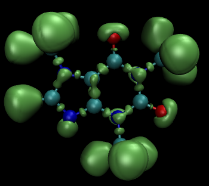
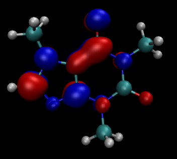
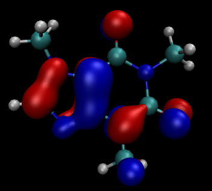

# ELF_dftbplus
A python code for DFTB+ electron localisation function (ELF), molecular orbital (MO) and charge density calculation. The tool for PLATO ELF calculation is available via https://github.com/d3iven005/PLATO-tools.
# USAGE
1. Run dftb+ programme and make sure that WritEigenvectors and EigenvectorsAsText = Yes.
2. Copy ".xyz", "band.out" and "eignvec.out" files to the "00_inputdata/" folder.
3. Copy "wfc.hsd" (STO file) of the datase you used to the "00_inputdata/" folder.
4. Modify the parameters in "input.py" as needed and run this code.
5. The output will be saved in the "01_results/" folder, visualise the "*.cube" file by VMD or other visualisation software.
# Example
Cafeine molecules input file and output file have been pre-placed in the "00_inputdata/" and "DFTB+_cal" folder. The default input file is configured for ELF calculation of a Caffeine molecule.

ELF of Caffeine molecule calculated by mio dataset

LUMO of Caffeine molecule calculated by mio dataset

HOMO of Caffeine molecule calculated by mio dataset
